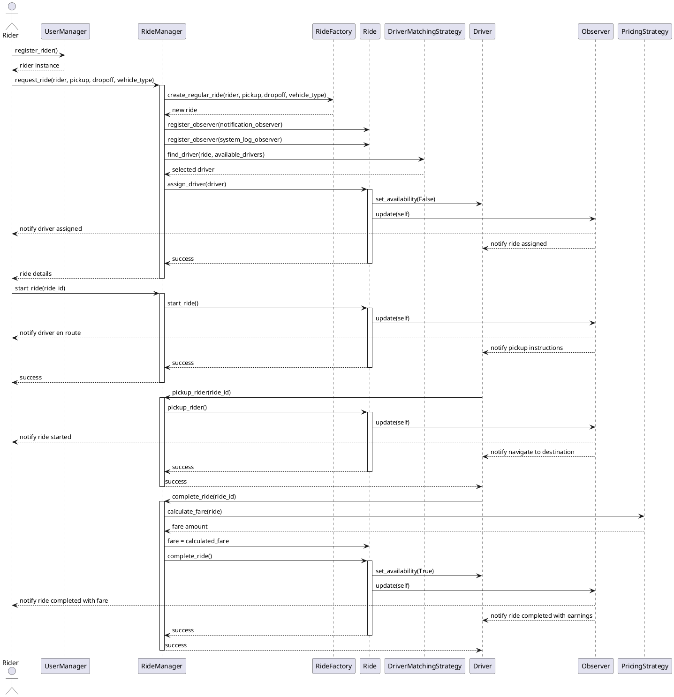

# UML Diagrams for Ride-Sharing Platform

This document contains UML diagrams for the ride-sharing platform in PlantUML format. You can generate these diagrams using any PlantUML compatible tool or online services like [PlantUML Web Server](https://www.plantuml.com/plantuml/uml/).

## Class Diagram

```plantuml
@startuml

skinparam classAttributeIconSize 0
skinparam classFontStyle bold
skinparam classBackgroundColor #F8F9FA
skinparam classBorderColor #DEE2E6
skinparam stereotypeCBackgroundColor #E9ECEF
skinparam stereotypeABackgroundColor #E9ECEF
skinparam stereotypeIBackgroundColor #E9ECEF
skinparam stereotypeEBackgroundColor #E9ECEF

' Abstract classes
abstract class User {
  + id: str
  - _name: str
  - _phone: str
  + name(): str
  + phone(): str
}

abstract class "<<ABC>>\nDriverMatchingStrategy" as DriverMatchingStrategy {
  + {abstract} find_driver(ride: Ride, available_drivers: List[Driver]): Optional[Driver]
}

abstract class "<<ABC>>\nPricingStrategy" as PricingStrategy {
  + {abstract} calculate_fare(ride: Ride): float
}

abstract class "<<ABC>>\nObserver" as Observer {
  + {abstract} update(ride: Ride): void
}

' User-related classes
class Rider {
  - _default_location: Tuple[float, float]
  - _current_location: Tuple[float, float]
  - _ride_history: List[str]
  + default_location(): Tuple[float, float]
  + current_location(): Tuple[float, float]
  + ride_history(): List[str]
  + update_location(location: Tuple[float, float]): void
  + get_location(): Tuple[float, float]
}

class Vehicle {
  + vehicle_id: str
  - _model: str
  - _vehicle_type: str
  - _capacity: int
  + model(): str
  + vehicle_type(): str
  + capacity(): int
}

class Driver {
  + vehicle: Vehicle
  - _current_location: Tuple[float, float]
  - _is_available: bool
  - _rating: float
  - _ride_history: List[str]
  + current_location(): Tuple[float, float]
  + is_available(): bool
  + rating(): float
  + ride_history(): List[str]
  + update_location(location: Tuple[float, float]): void
  + get_location(): Tuple[float, float]
  + set_availability(is_available: bool): void
  + update_rating(new_rating: float): void
}

' Ride-related classes
enum RideStatus {
  REQUESTED
  DRIVER_ASSIGNED
  DRIVER_EN_ROUTE
  RIDE_IN_PROGRESS
  COMPLETED
  CANCELLED
}

enum RideType {
  REGULAR
  CARPOOL
}

enum VehicleType {
  BIKE
  AUTO_RICKSHAW
  SEDAN
  SUV
}

class Ride {
  + id: str
  - _rider: Rider
  - _driver: Driver
  - _pickup_location: Tuple[float, float]
  - _dropoff_location: Tuple[float, float]
  - _vehicle_type: VehicleType
  - _ride_type: RideType
  - _status: RideStatus
  - _request_time: datetime
  - _start_time: datetime
  - _end_time: datetime
  - _fare: float
  - _distance: float
  - _observers: List[Observer]
  + rider(): Rider
  + driver(): Driver
  + pickup_location(): Tuple[float, float]
  + dropoff_location(): Tuple[float, float]
  + vehicle_type(): VehicleType
  + ride_type(): RideType
  + status(): RideStatus
  + request_time(): datetime
  + start_time(): datetime
  + end_time(): datetime
  + fare(): float
  + fare(value): void
  + distance(): float
  + observers(): List[Observer]
  - _calculate_distance(point1, point2): float
  - _notify_observers(): void
  + assign_driver(driver: Driver): bool
  + start_ride(): bool
  + pickup_rider(): bool
  + complete_ride(): bool
  + cancel_ride(): bool
  + register_observer(observer: Observer): void
  + remove_observer(observer: Observer): void
}

' Strategy implementations
class NearestDriverStrategy {
  + find_driver(ride: Ride, available_drivers: List[Driver]): Optional[Driver]
  - _calculate_distance(point1, point2): float
}

class HighestRatedDriverStrategy {
  + find_driver(ride: Ride, available_drivers: List[Driver]): Optional[Driver]
}

class BasePricingStrategy {
  + calculate_fare(ride: Ride): float
  - _get_base_fare(vehicle_type: VehicleType): float
  - _get_per_km_rate(vehicle_type: VehicleType): float
}

class PricingDecorator {
  - wrapped_strategy: PricingStrategy
}

class SurgePricingDecorator {
  - surge_multiplier: float
  + calculate_fare(ride: Ride): float
}

class DiscountDecorator {
  - discount_percentage: float
  + calculate_fare(ride: Ride): float
}

' Observer implementations
class RiderNotificationObserver {
  + update(ride: Ride): void
  - _notify_driver_assigned(ride: Ride): void
  - _notify_driver_en_route(ride: Ride): void
  - _notify_ride_started(ride: Ride): void
  - _notify_ride_completed(ride: Ride): void
  - _notify_ride_cancelled(ride: Ride): void
}

class DriverNotificationObserver {
  + update(ride: Ride): void
  - _notify_ride_assigned(ride: Ride): void
  - _notify_pickup_instructions(ride: Ride): void
  - _notify_ride_started(ride: Ride): void
  - _notify_ride_completed(ride: Ride): void
  - _notify_ride_cancelled(ride: Ride): void
}

class SystemLogObserver {
  + update(ride: Ride): void
}

' Factory
class RideFactory {
  + {static} create_regular_ride(rider, pickup, dropoff, vehicle_type): Ride
  + {static} create_carpool_ride(rider, pickup, dropoff, vehicle_type): Ride
}

' Singleton managers
class "<<Singleton>>\nRideManager" as RideManager {
  - _instance: RideManager
  - rides: Dict[str, Ride]
  - active_rides: Dict[str, Ride]
  - available_drivers: List[Driver]
  - driver_matching_strategy: DriverMatchingStrategy
  - pricing_strategy: PricingStrategy
  + __new__(cls): RideManager
  - _initialize(): void
  + register_driver(driver: Driver): void
  + unregister_driver(driver: Driver): void
  + set_driver_matching_strategy(strategy: DriverMatchingStrategy): void
  + set_pricing_strategy(strategy: PricingStrategy): void
  + request_ride(rider, pickup, dropoff, vehicle_type): Optional[Ride]
  + request_carpool(rider, pickup, dropoff, vehicle_type): Optional[Ride]
  - _assign_driver(ride: Ride): bool
  + start_ride(ride_id: str): bool
  + pickup_rider(ride_id: str): bool
  + complete_ride(ride_id: str): bool
  + cancel_ride(ride_id: str): bool
  + get_ride(ride_id: str): Optional[Ride]
  + get_active_rides(): List[Ride]
  + get_available_drivers(): List[Driver]
}

class "<<Singleton>>\nUserManager" as UserManager {
  - _instance: UserManager
  - riders: Dict[str, Rider]
  - drivers: Dict[str, Driver]
  + __new__(cls): UserManager
  - _initialize(): void
  + register_rider(name, phone, default_location): Rider
  + register_driver(name, phone, vehicle_id, model, type, capacity, location): Driver
  + get_rider(rider_id: str): Optional[Rider]
  + get_driver(driver_id: str): Optional[Driver]
  + get_all_riders(): List[Rider]
  + get_all_drivers(): List[Driver]
  + update_rider_location(rider_id: str, location: Tuple[float, float]): bool
  + update_driver_location(driver_id: str, location: Tuple[float, float]): bool
}

' Inheritance relationships
User <|-- Rider
User <|-- Driver
DriverMatchingStrategy <|-- NearestDriverStrategy
DriverMatchingStrategy <|-- HighestRatedDriverStrategy
PricingStrategy <|-- BasePricingStrategy
PricingStrategy <|-- PricingDecorator
PricingDecorator <|-- SurgePricingDecorator
PricingDecorator <|-- DiscountDecorator
Observer <|-- RiderNotificationObserver
Observer <|-- DriverNotificationObserver
Observer <|-- SystemLogObserver

' Associations
Driver "1" --> "1" Vehicle : has >
Ride "1" --> "1" Rider : requested by >
Ride "1" --> "0..1" Driver : assigned to >
Ride "*" o--> "*" Observer : notifies >
Ride "*" --> "1" RideStatus : has >
Ride "*" --> "1" RideType : has >
Ride "*" --> "1" VehicleType : requires >
RideFactory ..> Ride : creates >
RideManager "1" o--> "*" Ride : manages >
RideManager "1" o--> "*" Driver : tracks available >
RideManager "1" --> "1" DriverMatchingStrategy : uses >
RideManager "1" --> "1" PricingStrategy : uses >
UserManager "1" o--> "*" Rider : manages >
UserManager "1" o--> "*" Driver : manages >

@enduml
```

## Design Pattern Diagram

```plantuml
@startuml

skinparam packageBackgroundColor #F8F9FA
skinparam packageBorderColor #DEE2E6
skinparam stereotypeCBackgroundColor #E9ECEF

package "Strategy Pattern" {
  interface "DriverMatchingStrategy" as DMS {
    + find_driver(ride, drivers)
  }

  class "NearestDriverStrategy" as NDS {
    + find_driver(ride, drivers)
  }

  class "HighestRatedDriverStrategy" as HRDS {
    + find_driver(ride, drivers)
  }

  interface "PricingStrategy" as PS {
    + calculate_fare(ride)
  }

  class "BasePricingStrategy" as BPS {
    + calculate_fare(ride)
  }

  DMS <|.. NDS
  DMS <|.. HRDS
  PS <|.. BPS
}

package "Observer Pattern" {
  interface "Observer" as Obs {
    + update(ride)
  }

  class "RiderNotificationObserver" as RNO {
    + update(ride)
  }

  class "DriverNotificationObserver" as DNO {
    + update(ride)
  }

  class "SystemLogObserver" as SLO {
    + update(ride)
  }

  class "Ride" as R {
    - _observers: List[Observer]
    + register_observer(observer)
    + remove_observer(observer)
    - _notify_observers()
  }

  Obs <|.. RNO
  Obs <|.. DNO
  Obs <|.. SLO
  R o--> Obs : notifies >
}

package "Decorator Pattern" {
  interface "PricingStrategy" as PS2 {
    + calculate_fare(ride)
  }

  class "PricingDecorator" as PD {
    - wrapped_strategy: PricingStrategy
    + calculate_fare(ride)
  }

  class "SurgePricingDecorator" as SPD {
    - surge_multiplier: float
    + calculate_fare(ride)
  }

  class "DiscountDecorator" as DD {
    - discount_percentage: float
    + calculate_fare(ride)
  }

  PS2 <|.. PD
  PD <|-- SPD
  PD <|-- DD
  PD o--> PS2 : wraps >
}

package "Factory Pattern" {
  class "RideFactory" as RF {
    + create_regular_ride(rider, pickup, dropoff, vehicle_type)
    + create_carpool_ride(rider, pickup, dropoff, vehicle_type)
  }

  class "Ride" as R2 {
  }

  RF ..> R2 : creates >
}

package "Singleton Pattern" {
  class "RideManager" as RM {
    - _instance: RideManager
    + __new__(cls)
  }

  class "UserManager" as UM {
    - _instance: UserManager
    + __new__(cls)
  }
}

@enduml
```

## Sequence Diagram: Ride Booking Flow

## How to Use These Diagrams

1. Copy the PlantUML code for the diagram you want to generate
2. Paste it into a PlantUML compatible tool or online service
3. Generate the diagram

You can use:

- [PlantUML Web Server](https://www.plantuml.com/plantuml/uml/)
- VS Code with PlantUML extension
- IntelliJ IDEA with PlantUML plugin
- Or any other PlantUML compatible tool

## Diagram Descriptions

### Class Diagram

The class diagram shows all classes, their attributes (with privacy indicators), methods, and relationships. It clearly shows inheritance hierarchies, associations between classes, and implementation of interfaces.

### Design Pattern Diagram

This diagram focuses on the implementation of design patterns in the system, showing how the Strategy, Observer, Decorator, Factory, and Singleton patterns are used.

### Sequence Diagram

The sequence diagram illustrates the flow of a ride booking process from rider registration to ride completion, showing the interactions between different components of the system.
